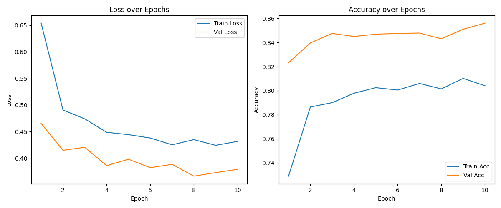
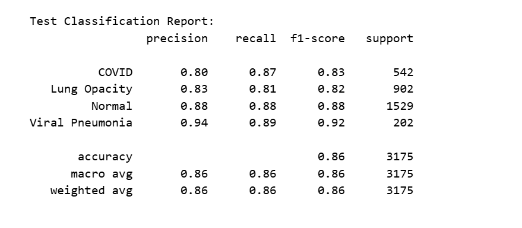
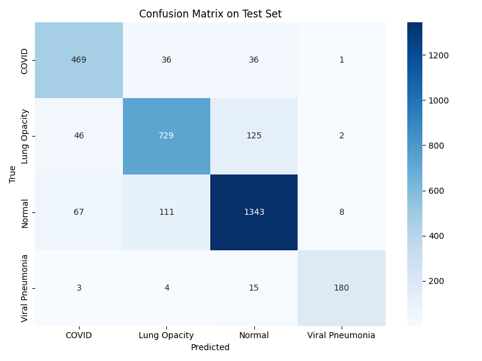
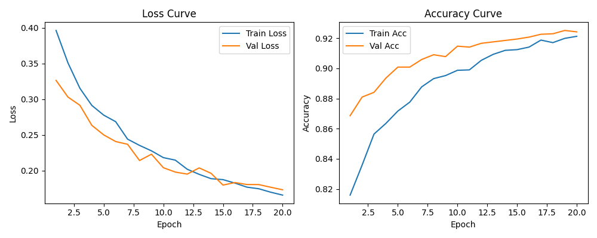
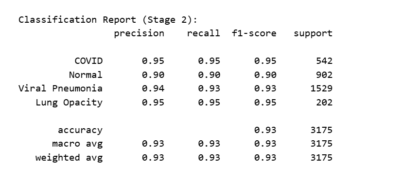
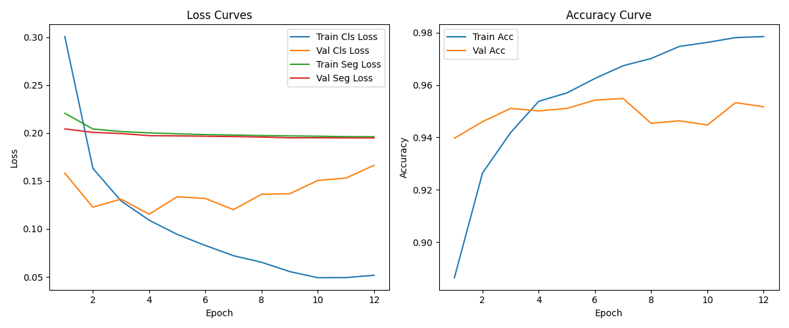
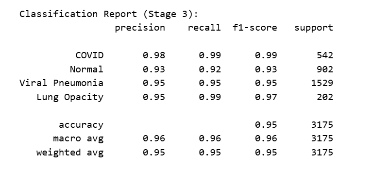
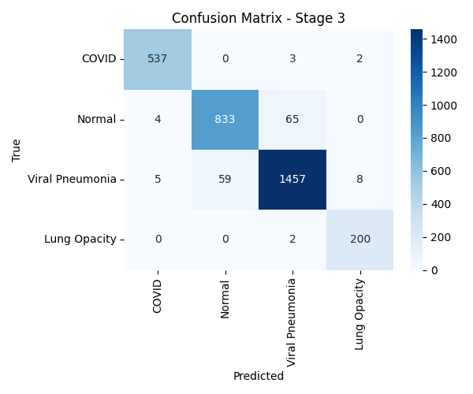
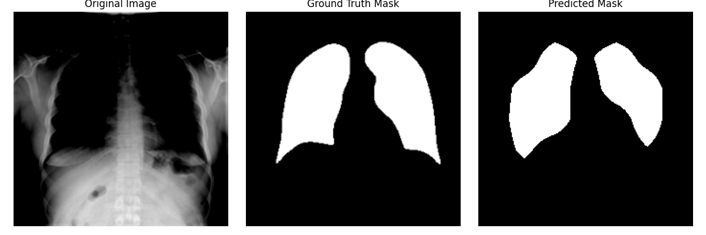

# Multi-Stage Transfer Learning for Joint Classification and Segmentation of Chest X-ray Images

**Author:** Huaizeng (Terry) Wang
**Supervisor:** Dr. Elsa Cardoso-Bihlo
**Program:** Master of Data Science, Memorial University of Newfoundland
**Date:** August 2025

---

## Overview

This project develops a deep learning-based **multi-task neural network** for the automatic classification of chest X-ray images, designed to assist in the diagnosis and screening of pulmonary diseases.

Using the **COVID-19 Radiography Dataset** from Kaggle, the model performs **four-class classification** (COVID-19, Normal, Viral Pneumonia, and Lung Opacity) and integrates **lung segmentation** as an auxiliary task to guide the network's attention to clinically relevant anatomical regions.

The project is built as a **three-stage progressive pipeline**, with each stage measured independently on a held-out test set — allowing a clear, quantified view of how much each technique (transfer learning → fine-tuning → multi-task learning) contributes to final performance.

> For the deployed, production version of this work — with a live API, Grad-CAM explainability, and LLM-generated reports — see [CXR Report Copilot](https://github.com/terrywang502/cxr-report-copilot).

---

## Three-Stage Pipeline

### Stage 1 — Transfer Learning Baseline
- Built with **EfficientNetB0** pretrained on ImageNet
- Backbone frozen; only the classification head is trained
- Establishes the baseline performance for comparison

### Stage 2 — Fine-Tuning
- Unfroze the deeper layers (blocks 6–7) of EfficientNetB0
- Allows the network to learn more domain-specific, task-relevant features
- Achieved a significant accuracy gain over Stage 1

### Stage 3 — Multi-Task Learning
- Added a **segmentation branch** that predicts lung masks alongside classification
- Joint optimization of classification loss + segmentation loss
- Guides the network to focus on anatomically relevant lung regions, improving robustness and generalization

---

## Dataset

- **Source:** [COVID-19 Radiography Database (Kaggle)](https://www.kaggle.com/datasets/tawsifurrahman/covid19-radiography-database)
- **Classes:**

| Category | Images |
|---|---|
| COVID-19 | 3,616 |
| Normal | 10,192 |
| Viral Pneumonia | 1,345 |
| Lung Opacity | 6,012 |

Each X-ray is paired with a corresponding lung mask, used as supervision for the segmentation branch in Stage 3. Significant class imbalance exists (Normal has ~7.6x more samples than Viral Pneumonia), addressed via stratified sampling, data augmentation, and weighted cross-entropy loss.

---

## Implementation

- **Framework:** PyTorch
- **Backbone:** EfficientNetB0
- **Loss functions:**
  - Weighted Cross-Entropy (classification)
  - Binary Cross-Entropy (segmentation)
  - Combined: `L_total = L_cls + 0.5 * L_seg`
- **Data augmentation:** Random rotation, horizontal flip, normalization
- **Optimization:** Adam + ReduceLROnPlateau + Early Stopping
- **Imbalance handling:** Stratified train/val/test split, dynamic class weights

---

## Results

### Performance Summary

| Stage | Description | Accuracy | Macro Recall | Macro F1 | Segmentation |
|:---|:---|:---:|:---:|:---:|:---:|
| 1 | Frozen EfficientNet (baseline) | 0.86 | 0.86 | 0.86 | ❌ |
| 2 | Fine-tuned (unfrozen upper layers) | 0.93 | 0.93 | 0.93 | ❌ |
| 3 | Multi-task (classification + segmentation) | **0.95** | **0.96** | **0.96** | ✅ |

Each stage delivers a measurable improvement, confirming that both fine-tuning and the addition of lung segmentation as an auxiliary task meaningfully improve classification performance — particularly **macro recall**, which matters most for minimizing missed diagnoses in a medical context.

---

### Stage 1: Transfer Learning Baseline

**Training curves:**



**Test classification report:**



**Confusion matrix:**



Stage 1 achieves a solid baseline (86% accuracy), with Viral Pneumonia classified most reliably and some confusion between Lung Opacity and Normal.

---

### Stage 2: Fine-Tuning

**Training curves:**



**Test classification report:**



**Confusion matrix:**


Unfreezing the upper convolutional blocks lets the network learn more task-specific features, lifting accuracy from 86% to 93%. Some confusion remains between Normal and Viral Pneumonia.

---

### Stage 3: Multi-Task Learning (Classification + Segmentation)

**Training curves:**



**Test classification report:**



**Confusion matrix:**



**Predicted vs. ground-truth lung masks:**



*Left: original X-ray · Middle: ground-truth lung mask · Right: model-predicted lung mask*

The multi-task model achieves the best results across all three stages (95% accuracy, 0.96 macro F1), with COVID-19 reaching a 0.99 F1-score. The predicted masks closely match ground truth, confirming the segmentation branch is learning meaningful anatomical structure — not just memorizing noise — and that this structural guidance translates into stronger, more generalizable classification.

---

## Why This Project

Most chest X-ray classification projects treat segmentation and classification as separate problems, or skip segmentation entirely. This project instead asks a more specific question: **does giving the model an anatomical "where to look" signal — without any lesion-level annotation — improve its ability to classify disease?**

The three-stage design isolates the answer. Rather than introducing transfer learning, fine-tuning, and multi-task learning all at once, each technique is added incrementally and evaluated independently on the same held-out test set, making the contribution of each step directly measurable rather than assumed.

---

## Tech Stack

`Python 3.10` · `PyTorch` · `Torchvision` · `Albumentations` · `NumPy` · `Pandas` · `Matplotlib` · `Seaborn` · `scikit-learn`

---

## Project Structure

```
covid19-xray-classification/
├── capstone_project.ipynb     # Full project notebook (training, evaluation, analysis)
├── outputs/
│   ├── stage1/                 # Baseline transfer learning results
│   ├── stage2/                 # Fine-tuning results
│   └── stage3/                 # Multi-task learning results
└── README.md
```

---

## Limitations & Future Work

- Lung masks used here outline anatomical structure only — not pathological regions. Lesion-level masks could further improve both performance and interpretability.
- Class imbalance still affects minority-class performance (e.g., Viral Pneumonia) despite weighted loss and stratified sampling; focal loss or synthetic augmentation could help.
- No post-hoc explainability (e.g., Grad-CAM) was applied in this notebook — this gap is addressed in the [deployed follow-up project](https://github.com/terrywang502/cxr-report-copilot).
- The dataset is single-source; testing on multi-institutional data would better validate generalization.

---

## Presentation

📊 [View the project presentation (PDF)](docs/capstone_presentation.pdf)

## Author

**Huaizeng (Terry) Wang** — Master of Data Science, Memorial University of Newfoundland
[LinkedIn](https://linkedin.com/in/terry-wang-767a53382) · [GitHub](https://github.com/terrywang502)

